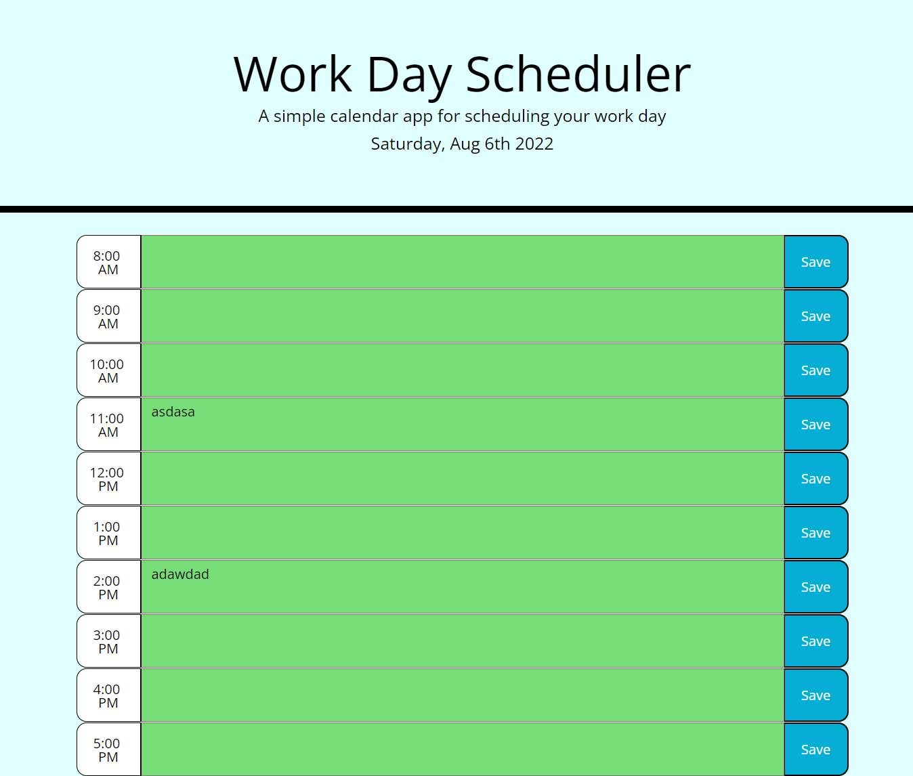

# 5_Daily_Scheduler

## Description
A daily work day planner using moment() api and jquery.  Saved data are stored in local storage and will render text on load.  moment() is used to display current day and update which timeblock is past/present/future via color styling in CSS.

## Language & API used
* HTML
* CSS
* Javascript
* Jquery
* Moment API

## Link to Website
https://crestatic.github.io/5_Daily_Scheduler/

## Screenshot
